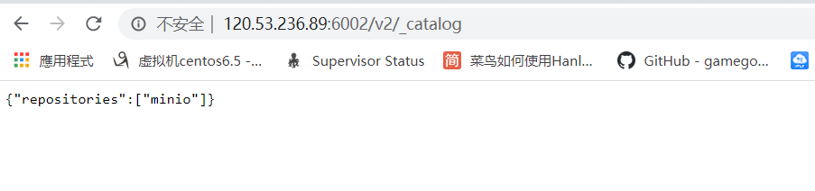
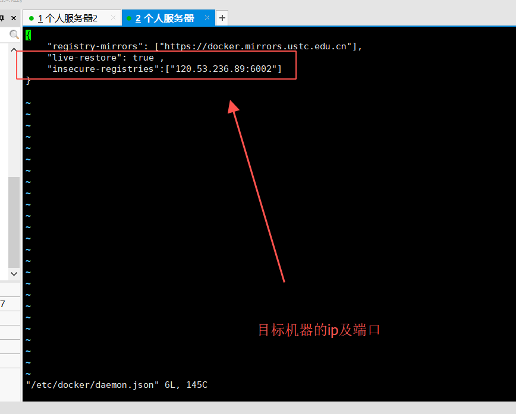
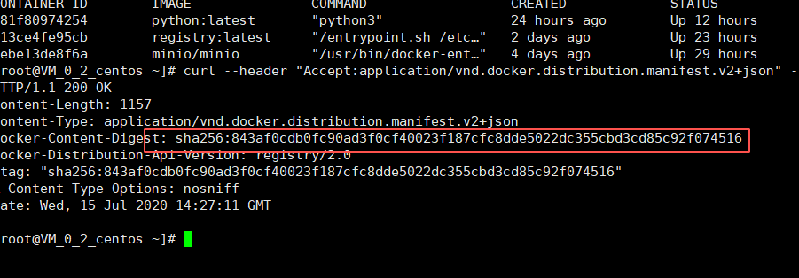
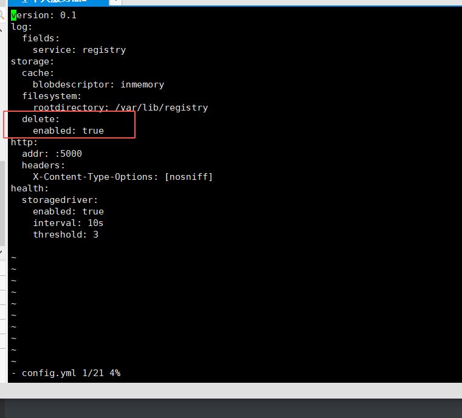

# 2.docker私服相关操作

## 1.docker私服的搭建

```python
#第一步下载docker私有仓库的镜像
docker pull registry:latest
#第二步开启容器,将私服仓库的存放路径映射到本机对应路径
docker run -di -p 6002:5000 --name=docker_hub -v /home/docker_hub:/var/lib/registry registry:latest
```



如上私有仓库启动成功且存有镜像

如果外部服务器想下载私有残酷镜像请执行以下操作

```python
vi /etc/docker/daemon.json
```



最后重新加载配置并重启docker服务

```python
systemctl daemon-reload && systemctl restart docker
```

## 2.docker私服删除镜像

```python
#首先先找到镜像的sha256
curl --header "Accept:application/vnd.docker.distribution.manifest.v2+json" -I -XGET http://127.0.0.1:6002(所在服务器的url)/v2/py1(镜像标签)/manifests/latest(镜像版本)
```



```python
#接着直接删除这个标签
curl -I -XDELETE http://127.0.0.1:6002(所在服务器的url)/v2/minio(镜像标签)/manifests/sha256:ca9a4b8a81fcbbbb9cf6b9630cb7b2b73b94bd7c33b5949d507b1af7943df413(查询出的sha值)
```

这里可能会出现一个问题,私有仓库默认是不允许进行delete操作的，你的删除操作出现405,请进入私服镜像做如下操作
cd /etc/docker/registry/
vi config.yml

添加如下配置



配置完成后重启docker服务即可

```python
#以上方法只是删除了tag,其镜像文件还没删除
因此你要进入到你的挂载目录进去删除你的镜像
#在删除仓库镜像后再去私服容器内执行以下命令,进行垃圾回收
registry garbage-collect /etc/docker/registry/config.yml
```

​    

