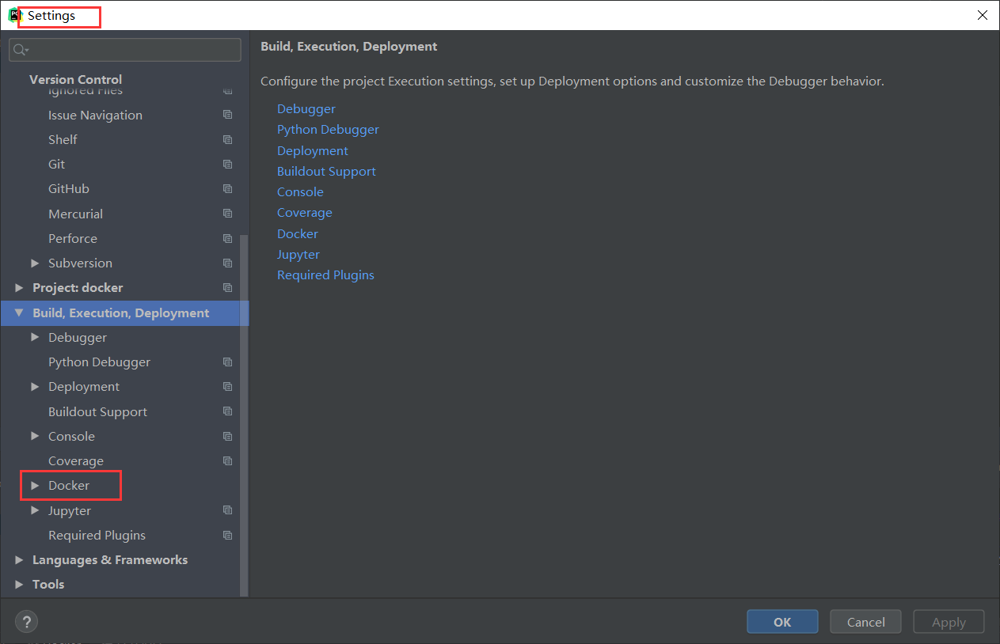

# pycharm连接docker开放的端口进行开发

##  第一步 配置http接口

```shell
配置 vim /lib/systemd/system/docker.service
# 内容
ExecStart=/usr/bin/dockerd -H tcp://0.0.0.0:6666 -H unix:///var/run/docker.sock
```


##  第二步 pycharm建立连接

在pycharm的settings中找到docker选项




## 第三步 开始运行dockerfile


第四步 运行dockerfile


## 第四步 远程停止容器与删除镜像


值的注意的是容器如果在运行，需要先停止容器才能删除镜像

## 第五步 推送镜像


但是，这一步貌似只对公有仓库有用