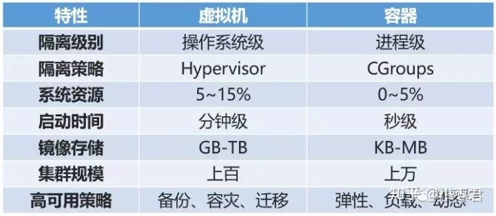

# docker

## 1.简介

docker是一个开源的应用容器引擎，基于go语言开发并遵循了apache2.0协议开源。docker可以让开发者打包他们的应用以及依赖包到一个轻量级、可移植的容器中，然后发布到任何流行的linux服务器，也可以实现虚拟化。容器是完全使用沙箱机制，相互之间不会有任何接口（类iphone的app），并且容器开销极其低。想深入了解的话建议搜索下虚拟化的概念。

## 2.docker与虚拟机的区别

第一点:docker可以直接与当前机器的系统进行通信，而虚拟机需要自己另装系统，这就导致第一个区别机器上的资源应用docker基本上就是对主机的全部资源都可调用，而虚拟机需要考虑的机器的资源进行划分开启新的系统。此外，虚拟机需要额外的空间来存储系统，并且在虚拟机启动的过程中其系统也占用着内存。

第二点:docker镜像拷贝往往是以MB为单位，而虚拟机的镜像拷贝是以GB为单位。因此，相比镜像保存docker更占优势，并且更适合做集群操作。




## 3、docker的优点	

​		灵活：即使是最复杂的应用也可以集装箱化。

​		轻量级：容器利用并共享主机内核。

​		可互换：您可以即时部署更新和升级。

​		便携式：您可以在本地构建，部署到云，并在任何地方运行。

​		可扩展：您可以增加并自动分发容器副本。

​		可堆叠：您可以垂直和即时堆叠服务。

​        跨平台:  在linux构建的镜像在其他系统上也能使用，因为构建时用的是基础镜像的系统，而资源用的是本机的

## 4.为什么选择docker

​		  1.每当你要将服务部署到新机器，都需要下载对应python环境以及对应的程序，这就会导致一个问题，在拷贝环境的时候在本地机器是完整的而在部署机器可能会出现缺少依赖、文件乱码等问题。这就需要一一去debug，而docker你可以理解为是一个集装箱，在其上面安装的任何文件都会被当作物品放入集装箱中，直到部署时整个集装箱就会进行转移，同步到其他机器上去。

​		   2.docker可以根据不同的服务，配置不同的环境去部署。这就避免了不同程序间的包冲突问题，这时，有人会说像anacoda不是能切换环境吗，这时就有一个问题了，譬如我以前两个应用程序是一起的那么可以切换环境，现在两个应用程序分开了，却需要两份anacoda环境并且其中的一个环境还占用着系统资源。

​		   3.有一天你的其中一个服务所依赖的包出现了问题，导致你所有的本机服务挂了，而docker根据不同的服务做了不同的镜像，就只会影响到其中某个服务，而其他服务仍正常运行。

## 5.docker的三大核心概念

​		镜像（Image）

​		容器（Container）

​		仓库（Repository）

### 1.容器

顾名思义就是存放东西的载具，而docker的容器指的就是承载服务和程序的一个盒子，不同的容器之间相互隔离，存放不同的应用

### 2.镜像

顾名思义就是与本体模棱两可的东西，他的作用对象是容器，将容器盒子拷贝一份整成一份一模一样的盒子，而这个新的盒子就是镜像。

### 3.仓库

顾名思义就是存放东西的地方，他的作用是存放镜像，仓库类似一个管道，有出口也有入口，入口进来的是镜像，出口出去的是也是镜像。其作用是将不同地方的镜像转发到需要的地方。

## 6.docker的安装与服务启动

```python
#首先将yum命令升级为最新
sudo yum update
#安装docker的依赖包
sudo yum install -y yum-utils device-mapper-persistent-data lvm2
#将yum云设置为阿里
sudo yum-config-manager --add-repo http://mirrors.aliyun.com/docker-ce/linux/centos/docker-ce.repo
#安装docker
sudo yum install docker-ce
#查看docker的版本
docker -v
#设置docker的镜像加速
vi /etc/docker/daemon.json
{
"registry-mirrors": ["https://docker.mirrors.ustc.edu.cn"]
}
#启动docker服务
systemctl start docker
#停止docker服务
systemctl stop docker
#重启docker服务
systemctl restart docker
#查看docker状态
systemctl status docker
#开机启动docker
systemctl enable docker
#关闭所有容器
docker stop `docker ps |  awk 'NR!=1{print $NF}'
```

## 注意事项

```shell
# 在docker_hub中下载镜像不要使用python:3.7这类大版本镜像,而去使用3.7.5类似这种指定版本镜像
docker pull python:3.6.5

```

